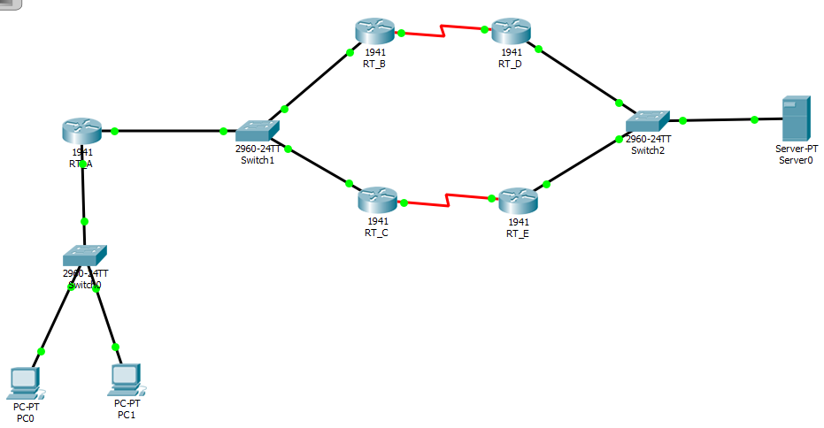
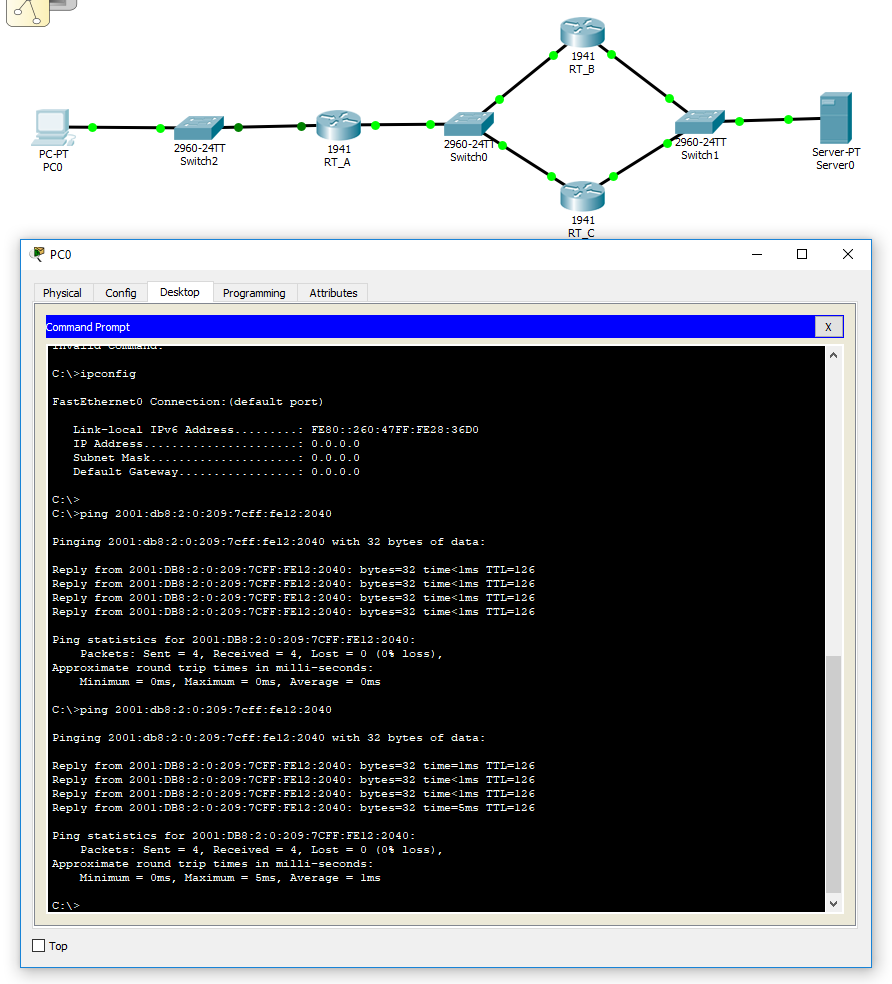
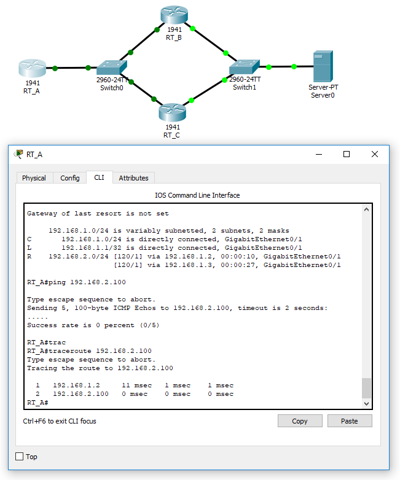
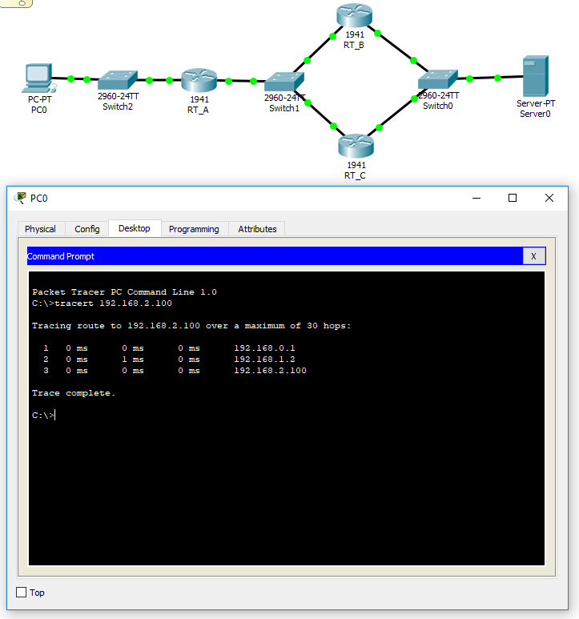

# routing_sandbox

Files of [Cisco Pakcet Tracer](https://www.netacad.com/courses/packet-tracer-download/) for my practice about routing and networking. They are based on [インターネットルーティング入門 第3版（友近剛史 池尻雄一 白﨑泰弘）｜翔泳社の本](https://www.shoeisha.co.jp/book/detail/9784798134819).

## internet_routing_3.3.1.pkt: Basic OSPF configuration

## internet_routing_3.3.3.pkt: Redistributing routes

## internet_routing_3.3.4.pkt: Cost

## internet_routing_3.5.3.pkt: OSPFv3

## internet_routing_4.3.1.pkt: Basic RIP configuration

## internet_routing_4.3.2.pkt: RIP configuration with a passive-interface

All code snippets are licensed under CC0 unless otherwise specified.

